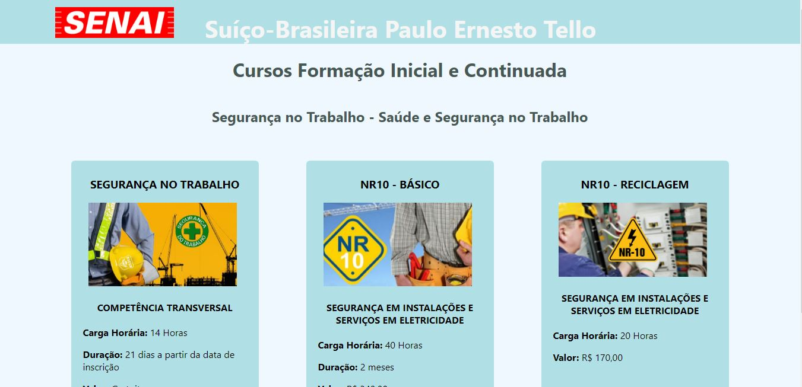
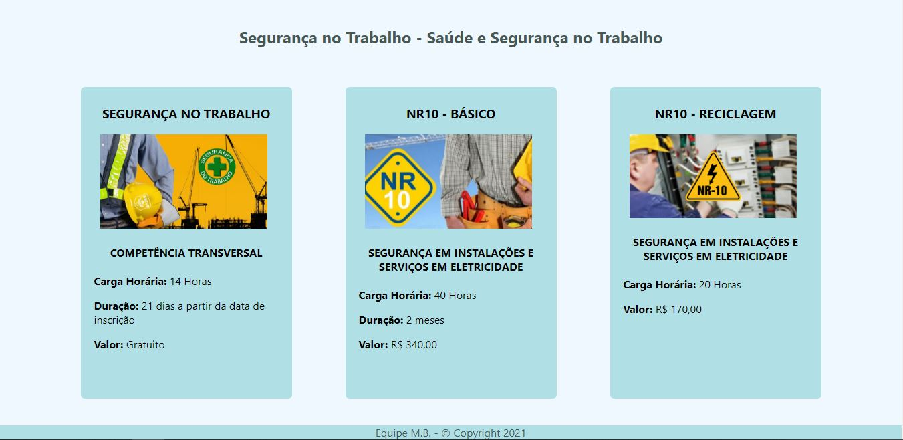
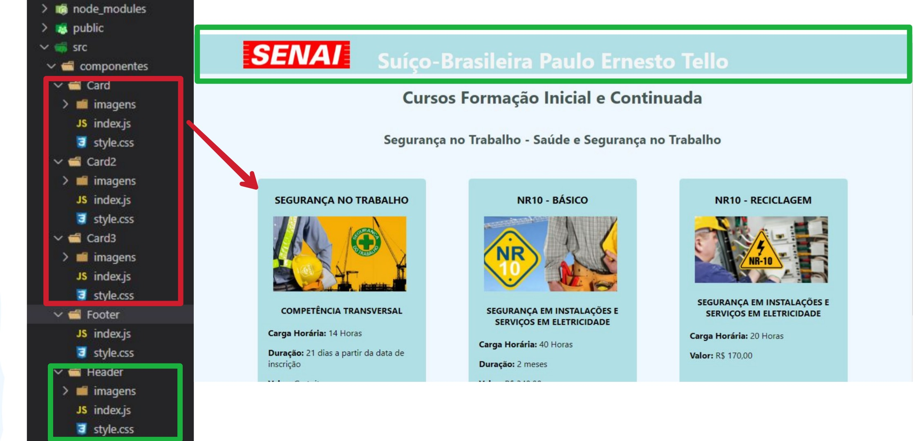
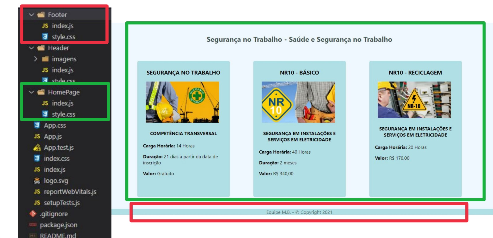

# SENAI Cursos FIC

## **Solicitado:**

Criar uma página web para a nossa escola que exiba informações dos cursos FIC:

1. Header - Nome completo da escola e logo.
   
2. HomePage que contenha três Cards que exiba:
- Titúlo,
- Duração
- Preço
- Uma imagem referente ao curso;
  
3. Footer - Exiba o nome da escola, nome da squad e copyright 2021;

4. Estilizar todos os componentes.
---
## **Conteúdo:**

#### - Visão Geral da Página

#### - Elementos:

- **Header** - Nome completo da escola e logo.
- **HomePage** - Três Cards exibindo:
  
  - Titulo.
  - Duração.
  - Preço.
  - Uma imagem refrente ao curso.

- **Footer** - Nome da squad e copyright 2021;

